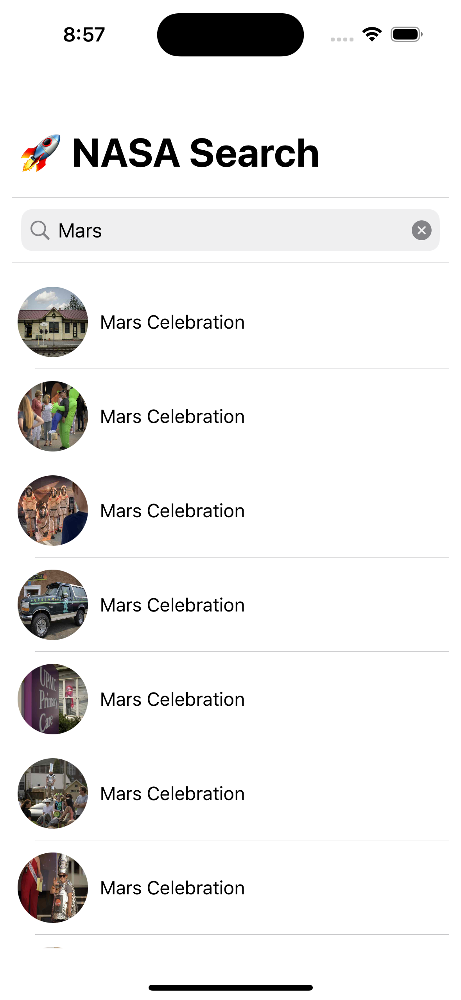
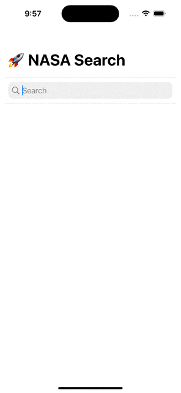
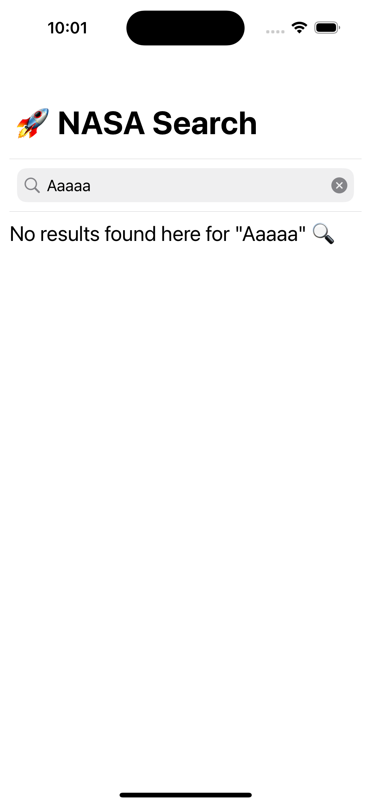
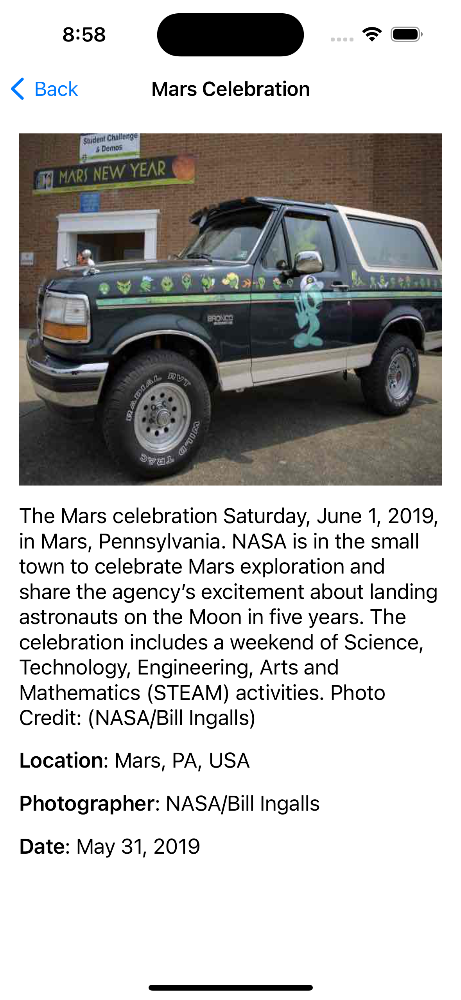

# NASA Search 🚀

## Table of Contents
1. [Summary](#summary)
  - [NASA Search Query List](#nasa-search-query-list)
2. [Architectural Approach](#architectural-approach)
    1. [Model](#model)
    2. [NASA Client API](#nasa-client-api)
    3. [Image Loader](#image-loader)
    4. [View Model](#view-model)
    5. [View](#view)
3. [Result Search List](#result-search-list)
4. [Result Detail View](#result-detail-view)
5. [Unit Tests](#unit-tests)

## Summary
Purpose of this coding challenge is the following:
1. Allow user to perform a query search via NASA's API
2. Display list of results, including title and image
2. Display a details screen when tapping on any result

Before jumping into coding, I made sure to fully understand the requirements and given REST endpoints.

To build and run the app, select any iPhone simulator in Xcode. Then use the keyboard shortcut (CMD + R) or from the Xcode top menu select **Product** -> **Run**.

<br />

### NASA Search Query List
By calling the [NASA Query Search Endpoint](https://images-api.nasa.gov/search?q=jupiter&media_type=image&page=1), it returns a list of search results via the following response:
```
{
    "collection": {
        "version": "1.0",
        "href": "http://images-api.nasa.gov/search?q=jupiter&media_type=image&page=1",
        "items": [
            {
                "href": "https://images-assets.nasa.gov/image/PIA01518/collection.json",
                "data": [
                    {
                        "center": "JPL",
                        "title": "Jupiter Plume",
                        "nasa_id": "PIA01518",
                        "date_created": "1999-03-13T14:54:19Z",
                        "keywords": [
                            "Jupiter",
                            "Voyager"
                        ],
                        "media_type": "image",
                        "description_508": "Jupiter Plume",
                        "secondary_creator": "NASA/JPL",
                        "description": "Jupiter Plume"
                    }
                ],
                "links": [
                    {
                        "href": "https://images-assets.nasa.gov/image/PIA01518/PIA01518~thumb.jpg",
                        "rel": "preview",
                        "render": "image"
                    }
                ]
            },
```

<br />

## Architectural Approach
Time to think about app architecture. I decided to go with the **MVVM (Model, View, View Model)** architecture for the following reasons:
- Ideal separation of concerns between modules.
- The UI will focus on simply displaying data
- The View Model will handle the logic and facilitate communication between the View and API module
- Since the ViewModel will be the source of the logic, I can make use of Swift `protocols` to abstract them using the `Factory Pattern` principle.
- Decoupled components means I can easily create unit tests.

I'll go over each architectual component.

<br />

### Model
For the **Model**, I used the `Codable` protocol to seamlessly decode API responses into Swift models.

Due to the complexity of the API response with mulitple nests, I created inner Codable models in order to fully decode all necessary properties for `SearchResult`.

<br />

### NASA Client API

For networking, I created a `NASAClientAPI` protocol abstraction then created a production version of the client API called `NASAClientProdAPI`. 

The client API handles the following:
- Keeps track of submitted query
- Handles paging logic
- Handles network request and decoding API response

<br />

### Image Loader
With any app, it's important to take caching into account - especially for **images**. 

Similar to the client API, I created an `ImageLoader` protocol abstraction then created a production version called `ImageProdLoader`.

The responsibilities of image loader include:
- Downloading an image using a search result's `imageURL` property.
- Before firing download request, adding it to a dictionary.
- Once image is downloaded, compressing image data to conserve memory.
- Storing downloaded image into a key-value cache (NSCache), which uses the search result's `id` as the key.
- Cancelling image download and removing download request from dictionary.

<br />

### View Model
A view model is the middle-man, handling logic of a view then communicates with other components to carry out requests. From there, it communicates back to the View which in turn updates the UI.

Due to the simple nature of this app `ListSearchViewModel` is the only view model within the app, which executes logic for the `ListSearchViewController`, communicates to the client API, then communicates changes back to the UI. 

<br />

### View
All views were created using Swift code and are primarily in SwiftUI, except for the `ListSearchViewController`. The `ListSearchViewController` is the initial screen where a user can perform a search and is presented with a list of search results.

<br />

## Result Search List
As mentioned before, `ListSearchViewController` handles searching and display search results.

Initially the list is empty. Once a search is performed after hitting `return`, then the list is populated with search results of that search.



<br />

Endless pagination support - more results are loaded the more you scroll down.


<br />


Clearing the search clears the entire list.



<br />

If your search generates 0 results, then a message appears letting you know there are no results from your search. 




<br />

## Result Detail View
`SearchResultDetailsView` is a simple SwiftUI view that displays details of any search result. By tapping on any result in the list, you'll be presented with a detailed view displaying the following:
- Title
- Image
- Description
- Location (if available)
- Photographer (if available)
- Date



<br />


## Unit Tests
Since many components were abstracted and decoupled, I created unit tests for logical and testable components which include:
- View Models
- Client API
- Image Loader

For the client API, I created mock versions of `NASAClientAPI`. I also imported JSON files of NASA API backend responses for the following scenarios:
- Query results of "mars"
- Query results of "jupiter"
- Query results of "aaaaaa" which generates empty results
- Invalid API response to intentionally fail JSON decoding

As a result, I was able to create unit tests and fully test logic of the client API **without** performing actual network requests.

Similar to the client API, I created a mock version of `ImageLoader` and created unit tests for all of its components.

Lastly, to fully test view models I used **dependency injection** to pass in a mock versions of Client API and Image Loader. 

Hence all logical components were tested with all unit tests passing. ✅